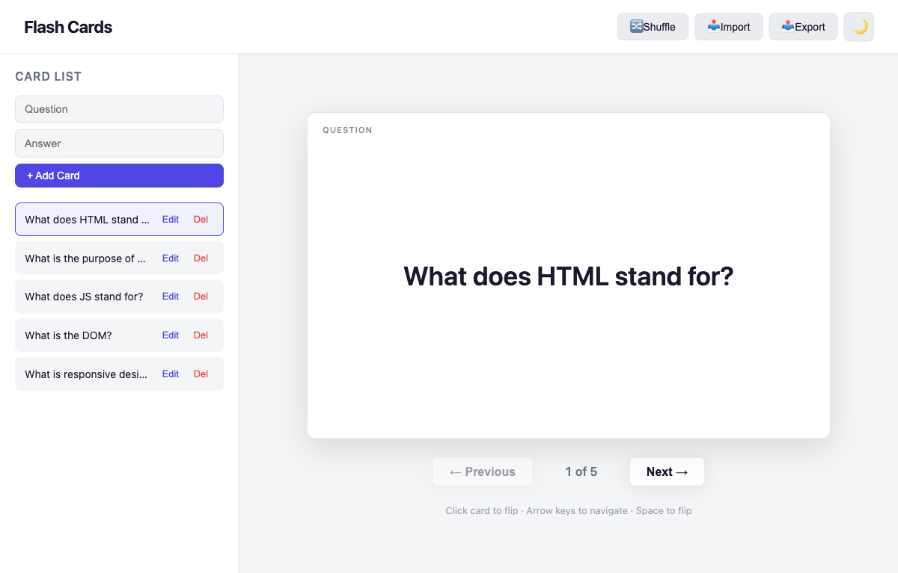

<div align="center">

# Flash Cards

[](https://developer.mozilla.org/en-US/docs/Web/HTML)
[](https://developer.mozilla.org/en-US/docs/Web/CSS)
[](https://developer.mozilla.org/en-US/docs/Web/JavaScript)
[](LICENSE)
[](https://alfredang.github.io/flashcard/)

**A modern, interactive flash card web app for presenters and trainers.**

[Live Demo](https://alfredang.github.io/flashcard/) · [Report Bug](https://github.com/alfredang/flashcard/issues) · [Request Feature](https://github.com/alfredang/flashcard/issues)

</div>

## Screenshot



## About

Flash Cards is a presentation-friendly web app that lets trainers and educators create, manage, and present flash cards with smooth 3D flip animations. Built with vanilla HTML, CSS, and JavaScript — no frameworks, no dependencies.

### Key Features

| Feature | Description |
|---------|-------------|
| **3D Flip Animation** | Smooth CSS 3D card flip to reveal answers |
| **Card Management** | Add, edit, and delete cards from the sidebar |
| **Navigation** | Previous/Next buttons with card counter |
| **Keyboard Shortcuts** | Arrow keys to navigate, Space/Enter to flip |
| **Dark/Light Mode** | Toggle theme with persistence via localStorage |
| **Import/Export** | Save and load card decks as JSON files |
| **Shuffle** | Randomize card order for varied practice |
| **Responsive** | Works on desktop, tablet, and projector displays |
| **Sample Cards** | Pre-loaded cards to get started instantly |

## Tech Stack

| Layer | Technology |
|-------|-----------|
| Structure | HTML5 |
| Styling | CSS3 (Custom Properties, 3D Transforms, Flexbox) |
| Logic | Vanilla JavaScript (ES6+) |
| Deployment | GitHub Pages |

## Architecture

```
┌─────────────────────────────────────────────┐
│                  Browser                     │
├──────────┬──────────────────┬───────────────┤
│ Sidebar  │  Presentation    │  Modal        │
│ - Form   │  - Flashcard     │  - Edit Card  │
│ - List   │  - Navigation    │               │
│          │  - Hints         │               │
├──────────┴──────────────────┴───────────────┤
│              script.js (State)              │
│  cards[] · currentIndex · render functions  │
├─────────────────────────────────────────────┤
│         localStorage (Theme Only)           │
└─────────────────────────────────────────────┘
```

## Project Structure

```
flashcard/
├── index.html          # Main HTML structure
├── style.css           # Styling, animations, responsive design
├── script.js           # App logic, state management, event handling
├── screenshot.png      # App screenshot
├── README.md           # This file
└── .github/
    └── workflows/
        └── deploy.yml  # GitHub Pages deployment
```

## Getting Started

### Prerequisites

- A modern web browser (Chrome, Firefox, Safari, Edge)
- No build tools or dependencies required

### Running Locally

1. **Clone the repository**
   ```bash
   git clone https://github.com/alfredang/flashcard.git
   cd flashcard
   ```

2. **Open in browser**
   ```bash
   open index.html
   ```
   Or simply double-click `index.html` in your file manager.

3. **Optional: Serve locally** (for development)
   ```bash
   python3 -m http.server 8000
   # Visit http://localhost:8000
   ```

## Usage

| Action | How |
|--------|-----|
| Add a card | Fill in Question & Answer, click **+ Add Card** |
| Flip a card | Click the card or press **Space / Enter** |
| Navigate | Click **Previous / Next** or use **Arrow Keys** |
| Edit a card | Click **Edit** on any card in the sidebar |
| Delete a card | Click **Del** on any card in the sidebar |
| Shuffle | Click the **Shuffle** button in the header |
| Export deck | Click **Export** to download as JSON |
| Import deck | Click **Import** to load a JSON file |
| Toggle theme | Click the **moon/sun** icon in the header |

## Deployment

This project is deployed automatically to GitHub Pages via GitHub Actions on every push to `main`.

**Live URL:** [https://alfredang.github.io/flashcard/](https://alfredang.github.io/flashcard/)

## Contributing

1. Fork the repository
2. Create a feature branch (`git checkout -b feature/amazing-feature`)
3. Commit your changes (`git commit -m 'Add amazing feature'`)
4. Push to the branch (`git push origin feature/amazing-feature`)
5. Open a Pull Request

## Acknowledgements

- Built with vanilla web technologies — no frameworks needed
- 3D flip animation inspired by CSS perspective transforms
- Developed with [Claude Code](https://claude.ai/code)

---

<div align="center">

**If you find this useful, give it a ⭐ on GitHub!**

</div>
